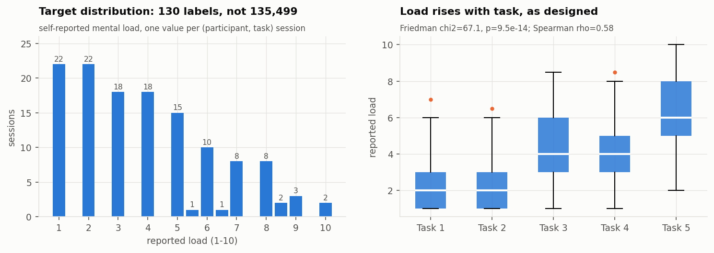
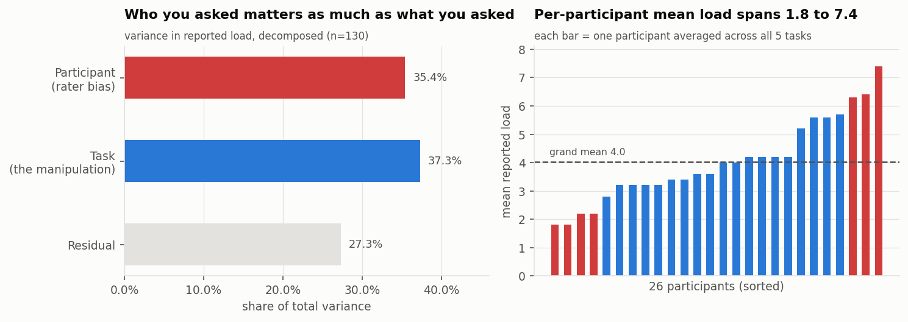
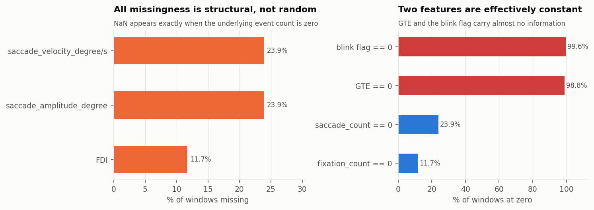
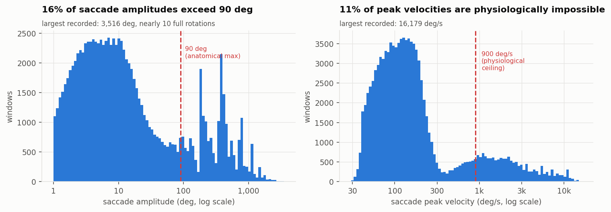
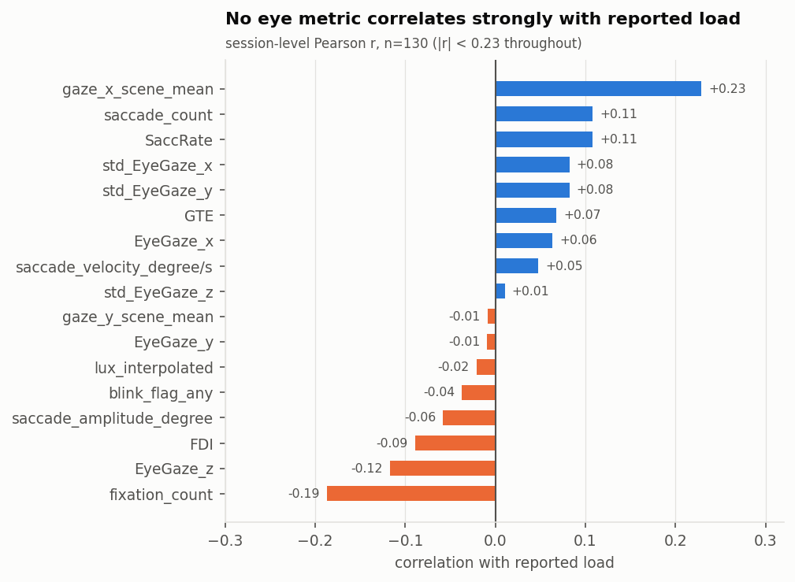
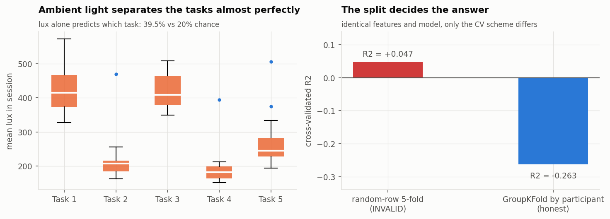
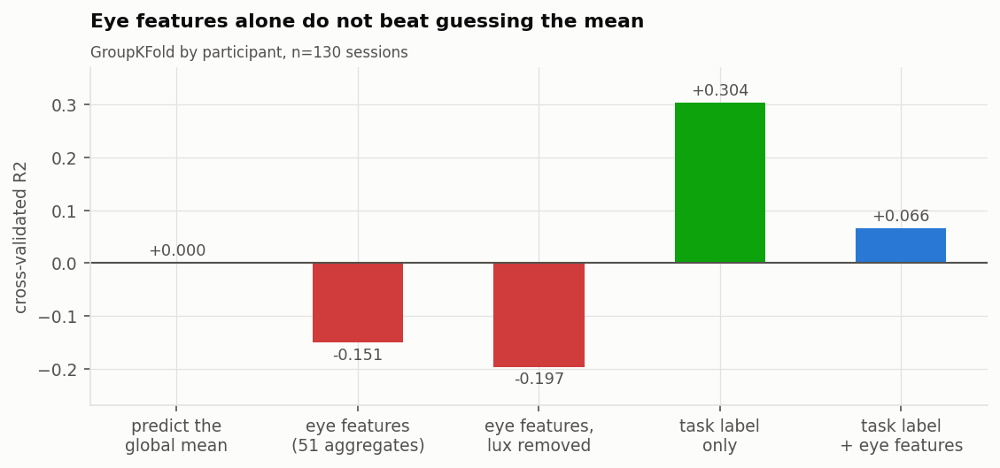
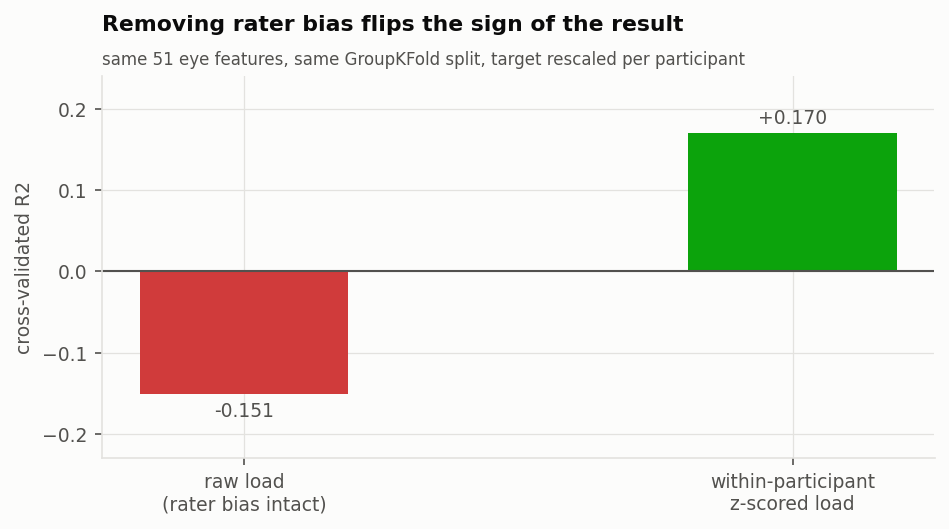

# GAZELOAD — Exploratory Data Analysis

Dataset: *GAZELOAD: A Multimodal Eye-Tracking Dataset* (Project Aria glasses)
Analysed: 2026-08-04 · 26 participants × 5 tasks = 130 sessions · 135,499 windows

> **Reading order.** This document is a from-scratch profile of the raw dataset,
> written independently of `methodology.md`. It converges with that methodology on
> almost every design decision. If you only read one thing, read
> **[gazeload-data-quality-actions.md](gazeload-data-quality-actions.md)** — it
> isolates the five findings the current pipeline does *not* handle and what to
> change. Feature-engineering results are in
> **[gazeload-feature-engineering.md](gazeload-feature-engineering.md)**.
>
> Note that the baselines in §7 below are *regression* baselines on the raw 1–10
> rating at session level (n = 130), deliberately naïve so the leakage
> demonstration is unobstructed. They are not comparable to the study's binary
> classification at 30 s epoch scale, and are not intended as competing results.

---

## TL;DR

The dataset is **structurally clean and well-formed** — 130 complete sessions, no
duplicates, no gaps, exactly 250 ms windows, and the target reproduces the
metadata spreadsheet perfectly. The experimental manipulation works: reported
load rises monotonically across the five tasks (Friedman χ² = 67.1, p = 9.5e-14).

But four things will silently wreck any model built on it:

| # | Issue | Consequence |
|---|---|---|
| 1 | **Effective n = 130, not 135,499** — the target is constant within a session | A random row split reports a positive R² where the honest answer is negative |
| 2 | **Ambient light is a task fingerprint** — lux alone identifies the task at 39.5% vs 20% chance | Any model given `lux_interpolated` learns the task schedule, not cognitive load |
| 3 | **Rater bias is as large as the manipulation** — participant identity explains 35.4% of target variance, task explains 37.3% | Absolute load is not learnable across people without per-participant normalisation |
| 4 | **21% of detected saccades are physiologically impossible** | The saccade features are a mixture of two populations, one of which is tracking noise |

Plus two red flags to escalate: **two participant names are embedded in the data
files** (de-identification failure), and **participant 07's gaze data is unusable**
(72–97% of windows have gaze pointing behind the head).

Feature-engineering response to these findings, with measured results:
[gazeload-feature-engineering.md](gazeload-feature-engineering.md).

---

## 1. Structure and provenance

| Directory | Files | Rows | Content |
|---|---|---|---|
| `01_Metadata` | 4 | — | `Tasks_Rating.xlsx` (26×9), plus the `metrics_extraction.py` / `pupil.py` derivation scripts |
| `02_Lux-Data` | 130 | 33,446 | 1 Hz ambient illuminance per session |
| `03_Eventlogger-Data` | 130 (+`Rename.py`) | 34,221 | 1 Hz event log, UTC |
| `04_eye-metrics` | 130 | 135,499 | The modelling table: 22 columns, 250 ms windows |

All 130 `(participant, task)` cells are present in **all three** streams — no
cross-stream coverage gaps.

**Integrity checks that pass.** Single header signature across all 130 files;
`tasks` matches the filename everywhere; window duration is exactly 250 ms with
zero variance; consecutive windows step by exactly 250 ms (no gaps); zero
duplicate rows; zero duplicate `(pid, task, timestamp)` keys; and the 130
`selfreport_mental_load` values reproduce `Tasks_Rating.xlsx` with **zero
mismatches**. Session lengths run 112–531 s (median 262 s).

**Metadata note.** The distribution is titled "…for Men", but
`Tasks_Rating.xlsx` records **16 male and 10 female** participants (ages 20–34,
mean 23.3), collected 2025-11-03 → 2025-11-09. Either the title is wrong or the
spreadsheet is; worth resolving before the demographic is cited anywhere.

---

## 2. The target: n is 130, not 135,499

`selfreport_mental_load(1-10)` is a **single rating per session**, broadcast
identically to every 250 ms window in that file (verified: max 1 unique value per
group). The 135,499-row table therefore carries **130 independent labels**.

Distribution over the 130 sessions: mean 4.02, SD 2.42, full 1–10 range used.
Mildly right-skewed — 62% of sessions rate ≤ 4, only 5 sessions rate ≥ 9. Three
sessions carry **half-step ratings** (5.5, 6.5, 8.5), so the scale is not
integer-valued; treat it as ordinal-continuous, not 10-class.

The manipulation is real and ordered — tasks 1–2 sit at mean 2.45, tasks 3–4 at
4.4, task 5 at 6.4 (Spearman ρ = 0.578, p = 6e-13).

### Rater bias rivals the manipulation

Decomposing target variance: **participant 35.4%, task 37.3%, residual 27.3%.**
Per-participant mean load spans 1.8 to 7.4 — some people never rate above 3, and
others never below 5, for the *same five tasks*. Absolute load is therefore
substantially a property of who was asked. Any cross-participant model must
normalise per participant or model the subject as a random effect.

---

## 3. Missingness — structural, not random

Only three columns have nulls, and each is **exactly explained** by an event
count of zero:

| Column | Missing | Mechanism |
|---|---|---|
| `saccade_amplitude_degree` | 23.90% | NaN ⟺ `saccade_count == 0` |
| `saccade_velocity_degree/s` | 23.90% | NaN ⟺ `saccade_count == 0` |
| `FDI` | 11.68% | NaN ⟺ `fixation_count == 0` |

This is MNAR-by-construction and **must not be mean-imputed** — the NaN means "no
event occurred", which is itself informative. Encode it as an explicit
`frac_no_saccade` / `frac_no_fixation` rate, then aggregate the metric over
non-null windows only.

Missingness rate varies 12.2%–35.5% across participants, so it doubles as a
data-quality covariate.

### Two features are effectively constant

- **`GTE`** (gaze transition entropy) is **0.0 in 98.8%** of windows, with only 9
  distinct values. A 250 ms window rarely contains a grid transition, so the
  metric has no room to vary. It needs recomputing over multi-second windows to
  mean anything.
- **`blink_flag_any`** fires in **0.4%** of windows. At a normal 15–20 blinks/min
  you would expect roughly 6–8% of 250 ms windows to contain one, so blink
  detection is under-triggering by an order of magnitude. Blink rate is a
  well-established load index — this one is not usable as shipped.

### One feature is exactly redundant

`SaccRate == saccade_count × 4` for **every row** (it is just the count rescaled
to Hz over a 250 ms window). Keep one.

---

## 4. Data quality: an artifact population inside the saccade features

The distributions are **bimodal, not heavy-tailed** — there are two distinct
populations:

| | Real saccades | Artifact population |
|---|---|---|
| Share of windows with a saccade | 79.0% | **21.0%** |
| Median amplitude | 6.3° | **359°** |
| Peak velocity > 900°/s | 0.4% | **68.9%** |

Maxima are **3,516°** amplitude (≈ 10 full rotations of the eye) and
**16,179°/s** — against an anatomical range of ~90° and a physiological ceiling
around 700–900°/s. The over-90° amplitudes cluster on **repeated discrete values
near 180°**, the signature of a gaze-vector sign flip or tracking dropout being
scored as one enormous saccade. Crucially, the impossible amplitudes and the
impossible velocities are **the same windows**, confirming a single failure mode
rather than two independent glitches.

Artifact rate varies **4.7% to 44.7%** across participants (9.6×).

### Gaze vectors are not always valid

- **`EyeGaze_z < 0` in 9.0% of all windows** — a unit gaze vector pointing behind
  the head. Per participant this ranges 0% to **89.6%**.
- **15.5% of gaze vectors are not unit-length** (|‖v‖ − 1| > 0.01), up to 33.7%
  for one participant. The column is documented as a direction vector, so this
  indicates a normalisation or fitting failure upstream.

**Participant 07 should be excluded.** All five of their sessions have 72–97% of
windows with `EyeGaze_z < 0`. Twenty-three of 130 sessions exceed 10%
(participants 07, 13, 24, 02, 26 worst).

Reassuringly, neither the artifact rate (ρ = −0.051, p = 0.56) nor the invalid-gaze
rate (ρ = −0.064, p = 0.47) correlates with the target, so this is noise rather
than a confound — it costs power, it does not manufacture a false result.

---

## 5. Relationships with the target

At the honest unit of analysis (130 sessions), **no eye metric exceeds |r| = 0.23**.
Strongest: `gaze_x_scene_mean` +0.23, `fixation_count` −0.19, `EyeGaze_z` −0.12.
`fixation_count` falling as load rises is directionally consistent with the
literature (longer, fewer fixations under load).

Row-level correlations are all |r| < 0.10 and are **not interpretable** — with the
target constant inside each session, a row-level correlation mostly measures
between-session differences at inflated n.

---

## 6. Leakage scan

### 6.1 The split itself is the biggest leak

Because the label is constant within a session, a random row split puts windows
from the *same* session in both train and test. The model memorises the session,
not the construct.

Identical features, identical model, only the CV scheme changed:

| Split | R² |
|---|---|
| Random-row 5-fold | **+0.047** ← invalid |
| GroupKFold by participant | **−0.263** ← honest |

The invalid split does not merely inflate the score, it **flips its sign** — a
model that is worse than predicting the mean looks like it works.
**`GroupKFold`/`LeaveOneGroupOut` on `pid` is mandatory.** Grouping on session
rather than participant is still not enough, because a subject fingerprint
survives: features predict *participant identity* at 22.6% vs 3.8% chance.

### 6.2 `lux_interpolated` is a task label in disguise

Mean session lux by task: **T1 426, T2 212, T3 420, T4 188, T5 265**. Lux is
tightly determined by which task was running (η² of session identity = 0.56), and
**lux alone classifies the task at 39.5% against 20% chance** — essentially all of
the 40.7% reachable with the full feature set.

Its direct correlation with load is negligible (ρ = 0.035, p = 0.70), so it looks
harmless to a naïve correlation scan. It is not: because task explains 37% of
target variance, lux is a **back-door path to the target through task identity**.
Either drop it, or keep it only as a pupil-correction covariate.

### 6.3 Hard identifiers

`timestamps_start_ms` is device uptime (60 s → 19.1 h) and **identifies the
session perfectly** (η² = 1.000) with non-overlapping per-session ranges. Never a
feature. `Participant_ID` and `tasks` are likewise identifiers, not inputs.

No feature reaches |r| > 0.95 with the target — there is no classical
"too-good-to-be-true" leak. Every leak here is structural.

---

## 7. Honest baselines

Session-level aggregates, `GroupKFold(5)` by participant, n = 130:

| Model | R² | MAE |
|---|---|---|
| Predict the global mean | 0.000 | 2.00 |
| Eye features (51 aggregates) | **−0.151** | 2.06 |
| Eye features, lux removed | −0.197 | 2.16 |
| **Task label only** | **+0.304** | 1.63 |
| Task label + eye features | +0.066 | 1.92 |

**The mean/SD/median aggregates carry no usable signal about absolute load** — they
lose to the intercept. The task label alone reaches R² = 0.304, and adding eye
features to it *hurts* (0.304 → 0.066): 51 features over 130 samples overfits.
This is the number any physiological model must beat, and it requires no eye
tracker at all.

### The single most useful transformation

Rescaling the target within each participant — removing the 35% rater-bias
component — takes the same features and split from **R² = −0.151 to +0.170**. The
signal was always there; between-subject rating bias was drowning it.

> **Caveat, and it matters:** z-scoring the *target* per participant requires that
> person's own ratings, which you do not have for a new user. Treat +0.170 as a
> **ceiling** on what the features can do once rater bias is gone, not as a
> deployable score. Normalising *features* per participant is legitimate (it needs
> only a calibration window of their eye data, no labels) — see the
> feature-engineering doc for the separation.

---

## 8. Escalations

1. **De-identification failure.** `Participant_ID` contains the literal strings
   **`Hedi`** (in `01_2`, `01_3`, `01_4`) and **`Wassim`** (in `02_3`, `02_4`,
   `02_5`) instead of a numeric code. Two participants' first names ship with the
   data. This needs fixing at the source before redistribution, and may be
   reportable depending on the consent terms.
2. **Participant 07 is unusable** (72–97% invalid gaze across all 5 sessions).
3. **Pupil diameter is missing from the release.** `01_Metadata/pupil.py`
   computes lux-normalised pupil diameter and writes `*_pupil_final.csv` with
   `average_PupilDiameter_mm_norm` and friends — but **no pupil CSVs are
   included**. Pupil dilation is the single best-established ocular index of
   cognitive load, and the pipeline for it already exists. Requesting these files
   is the highest-value action available.
4. **Event log carries no task semantics.** The only `Action` strings in the
   entire corpus are `action`, `Start of experiment`, `End of experiment`, and
   `Start/End action: Error`. The literal `"Error"` appears where an action name
   should be, across **78 of 130 sessions** (tasks 3, 4, 5 only) — a logger bug
   that lost the per-trial labels. Without them, no trial-level segmentation is
   possible.
5. **Marker and duration inconsistencies.** Three sessions have duplicate
   start/end markers (`13_2`, `13_3`, `18_1`). The eye stream is > 30 s shorter
   than the event log in 12 sessions — worst is `13_2` at **425 s missing**
   (327 s of eye data against a 752 s log). Sessions with large discrepancies
   should be audited before use.

---

## 9. Hand-off

**Unit of analysis.** One row per `(participant, task)` session; n = 130. Window-level
rows are for computing features, never for counting samples.

**Split.** `GroupKFold`/`LeaveOneGroupOut` on `pid`. Never random-row. With n = 130
and 26 groups, prefer leave-one-participant-out and report the SD across folds.

**Drop before modelling:** `timestamps_start_ms`, `timestamps_end_ms`,
`Participant_ID`, `tasks` (identifiers); `SaccRate` (= 4 × `saccade_count`);
`lux_interpolated` (task fingerprint); `GTE` and `blink_flag_any` as shipped
(degenerate). Consider dropping participant 07.

**Clean:** null out saccade metrics where amplitude > 90° or velocity > 900°/s,
and keep the artifact *rate* as a quality feature.

**Do not impute** the structural NaNs — encode the zero-event rate instead.

**Metric.** MAE on the 1–10 scale, plus **within-participant Spearman ρ**, which is
the quantity a deployed system actually needs (is this person more loaded now than
before?) and is immune to rater bias. Report against both the global-mean and the
task-label-only baselines.

**Expect modest numbers.** With 130 labels, a 35% rater-bias component, and a
21% artifact rate in the saccade channel, this dataset supports "the features
carry a weak within-person signal", not "we can predict mental load".
