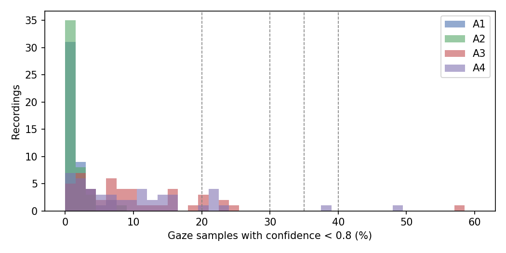
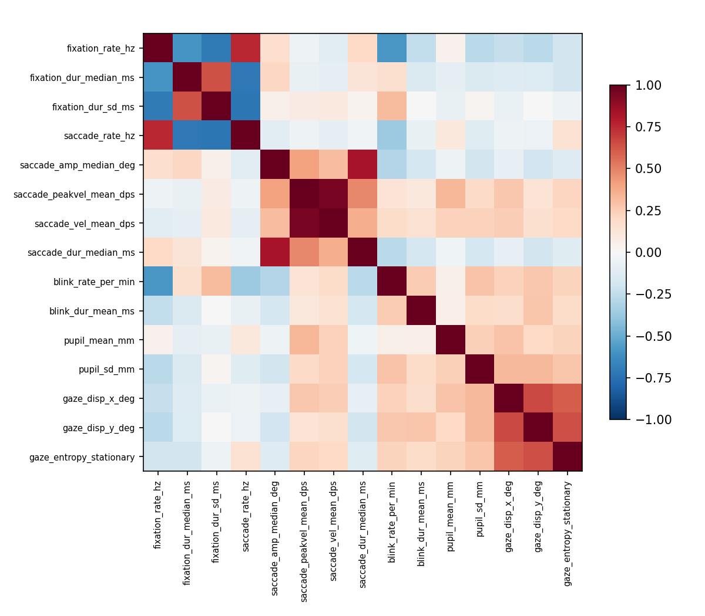

# COLET Data Exploration (for decisions C3 and C4)

Run on 2026-10-01 with `python docs/colet-eda/eda_colet.py`.

- **Outputs:** `quality.csv` (per recording), `features_v0.csv` (first-pass whole-activity
  features), and two figures.
- **First-pass settings:** confidence ≥ 0.8 as valid; I-VT at 45°/s with a 55 ms minimum
  fixation (the COLET paper's settings); 5-sample velocity smoothing; peak velocity
  > 1000°/s rejected.
- **What we did not look at:** features were checked for **quality only**, not for how well
  they separate A1 from A4. Choosing features on label separation before testing would bias
  the results.

## C3: data quality and exclusion

| Activity | Gaze samples with confidence < 0.8: median | 95th percentile | Max |
|---|---|---|---|
| A1 | 0.9% | 4.6% | 7.1% |
| A2 | 0.7% | 3.5% | 8.6% |
| A3 | 7.5% | 22.8% | 57.4% |
| A4 | 7.5% | 22.8% | 48.6% |

**What each threshold would remove:**

| Exclude if invalid > | Recordings removed (of 188) | Participants lost from A1 vs A4 |
|---|---|---|
| 20% | 13 | 7 (P06, P17, P21, P30, P40, P44, P47) |
| **30% or 35%** | **3** | **2 (P06, P17; both lose A4)** |
| 40% | 2 | 1 (P17) |
| 50% | 1 | 0 |

**Worst recordings:** P06 A3 (57%), P17 A4 (49%), P06 A4 (39%). Everything else is ≤ 24%.

**Notes:**
- Single-task activities are almost clean. Multitask activities lose more samples (talking,
  blinks).
- A low threshold (20%) would mostly remove multitask recordings, which biases which
  high-load data survive.
- **Blinks:** 211 of 1,992 blink events (11%) fall outside a plausible 50–500 ms. These are
  removed at feature level.

## C4: feature quality

**1. Our pipeline vs COLET's published means (Table 4)**

| Feature | A1–A4, ours | A1–A4, COLET | Match? |
|---|---|---|---|
| Pupil diameter (mm) | 3.50 / 3.67 / 3.74 / 3.80 | 3.49 / 3.66 / 3.80 / 3.82 | ✅ |
| Blink duration (ms) | 204 / 199 / 228 / 213 | 206 / 200 / 229 / 212 | ✅ |
| Blink rate (/min) | 3.1 / 1.9 / 15.1 / 15.2 | 3.0 / 1.8 / 14.4 / 14.4 | ✅ |
| Fixation rate (/s) | 3.44 / 3.64 / 2.76 / 2.87 | 2.50 / 2.80 / 2.24 / 2.35 | ⚠ same pattern, higher level |
| Fixation duration median (ms) | 196 / 186 / 207 / 201 | 273 / 244 / 269 / 254 | ⚠ shorter |
| Saccade amplitude median (°) | 2.6 / 2.8 / 2.4 / 2.5 | 14.1 / 14.0 / 14.2 / 14.1 | ❌ very different |
| Saccade rate (/s) | 4.0 / 4.3 / 3.4 / 3.5 | 1.7 / 1.9 / 3.4 / 3.4 | ❌ |
| Saccade peak velocity (°/s) | 170 / 180 / 180 / 191 | 217 / 204 / 350 / 357 | ❌ |
| Saccade duration median (ms) | 30 / 31 / 29 / 29 | 15 / 15 / 19 / 19 | ❌ |

> **Caution:** the fixation and saccade numbers in this table come from a hand-rolled
> first-pass detector with unsourced details. Do not use them. See `methodology-colet.md`
> §5 for the sourced recipe that replaces it.

**Reading this table:**
- **Pupil and blink features reproduce COLET almost exactly,** so they are ready to use.
- **Fixation and saccade features do not yet match.** The likely cause is that we computed
  gaze angles from the 3D gaze point, while COLET converted the 2D normalized screen
  coordinates to degrees. Smoothing differences matter too.
- **Superseded:** the final method uses the per-eye gaze directions (`gaze_normal0/1`,
  averaged) plus a per-activity sanity check (decisions D-M1 revised by R4-1, V2-2, R4-2;
  researcher-notes N18, N23, N25). The 3D gaze point used here is unreliable (N25). Table 4 is compared descriptively, not as a
  target.

**2. Redundant pairs (|Spearman ρ| > 0.8)**
- Saccade peak velocity ↔ mean saccade velocity: ρ = 0.95. **Keep one** (peak velocity is
  the literature measure).
- Saccade amplitude ↔ saccade duration: ρ = 0.83. This is expected from the "main sequence"
  relationship. Keep both, or drop duration.

**3. Missing values and outliers**
- Blink duration is missing in 41 of 188 recordings: activities with no valid blink,
  mostly A2. This missingness is structural.
  - XGBoost handles it natively.
  - LR needs imputation plus an indicator (MD1).
- Horizontal gaze dispersion reaches 102° in at least one recording. That is impossible on
  a screen 80 cm away, so it is an artifact. **Superseded:** the artifact came from the 3D gaze
  point placing gaze behind the camera (round-4 review R4-1). Gaze is now computed from
  `gaze_normal0/1`; max spread 9.4° (researcher-notes N25, `check_r4_1.py`).
- Stationary gaze entropy is computed on world-camera coordinates, not screen coordinates.
  It is approximate, so treat it as exploratory.

## Suggested decisions (for the team): SUPERSEDED

> Final decisions: C3 and C4 in `rrl-decision-log.md`. Blink duration was dropped (D-M3).
> The list below is kept for history.

- **C3:** exclude recordings with **> 35% invalid gaze samples** (Nenna 2023 precedent).
  This removes 3 recordings and drops P06 and P17 from A1 vs A4, leaving **45 participants**.
- **C4 core set:**
  - pupil mean and SD;
  - blink rate and blink duration (**blink duration later dropped, D-M3**);
  - fixation rate and duration;
  - saccade rate, amplitude and peak velocity;
  - gaze dispersion x/y.

  The gaze-event features are used only **after** they reproduce COLET Table 4.
- **C4 dropped or exploratory:**
  - mean saccade velocity (duplicate of peak velocity);
  - stationary gaze entropy (exploratory);
  - saccade duration (optional; correlated with amplitude).
