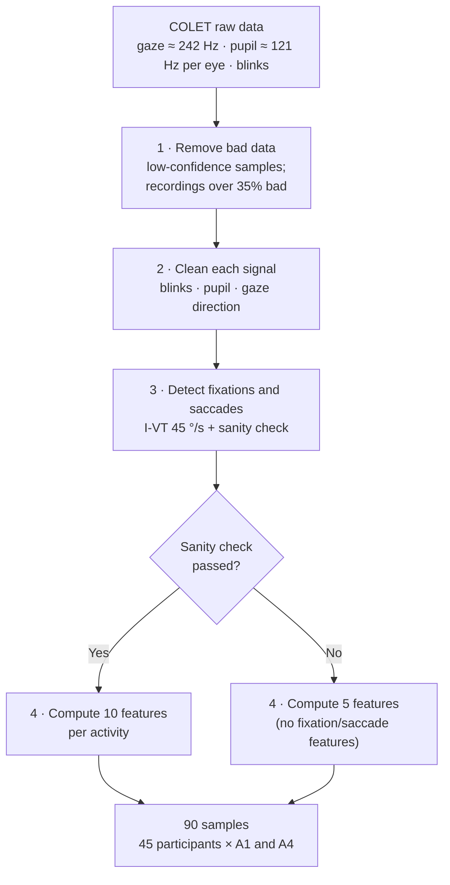
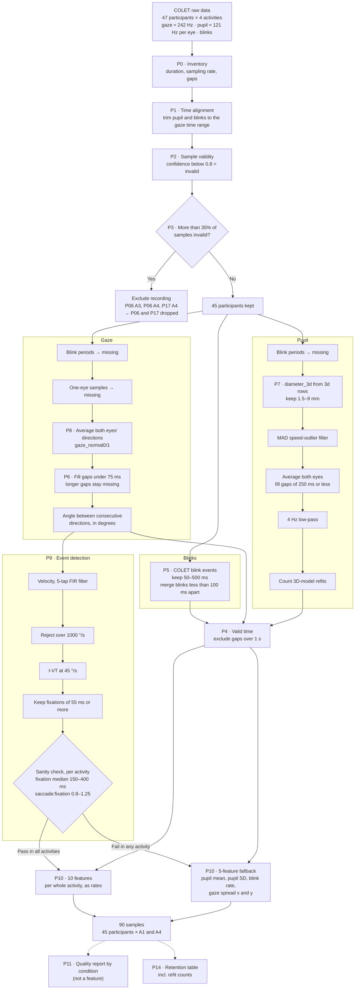
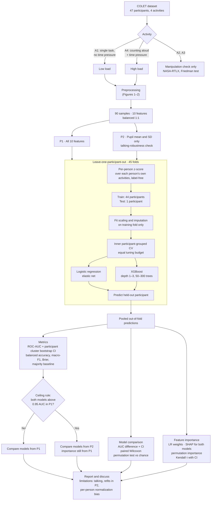

# Methodology Flowcharts — COLET

Flowcharts of the plan in `methodology-colet.md` (as of 2026-10-01, after the round-4 review).
They render in GitHub, VS Code (Mermaid extension), Obsidian, or https://mermaid.live.

- **Figure 1** is the simple version for the thesis (Chapter 3).
- **Figure 2** is the detailed version, a reference for writing the pipeline code.
- **Figure 3** is the full methodology.
- The table after Figure 2 lists the RRL source for each preprocessing step.

Not shown: optional analyses (S1–S5) and the pinned luminance check (C8), which are outside the
required scope (`methodology-colet.md` §0, §17).

---

## Figure 1. Preprocessing (simple, for the thesis)

| Stage | Plain words | Steps (`methodology-colet.md` §4) |
|---|---|---|
| 1. Remove bad data | Drop samples the tracker wasn't sure about, and recordings that are mostly bad | P1, P2, P3 |
| 2. Clean each signal | Blinks: keep real ones. Pupil: standard cleaning. Gaze: average the two eyes, fill tiny gaps | P5, P6, P7, P8 |
| 3. Find fixations and saccades | When the eye holds still vs jumps; check the result looks normal | P9 (§5) |
| 4. Compute features | One number per feature per activity | P4, P10 |

P0 (inventory), P11 (quality report) and P14 (retention table, incl. refit counts) only report
numbers; they do not change the data.

## Figure 2. Preprocessing (detailed, for the code)

### Where each preprocessing step comes from

- ✅ **Done by a study:** an eye-tracking study did this step.
- 📘 **Guideline:** a methods paper recommends it.
- ⚙️ **Our own:** no source; justified by our data check (design choice, `methodology-colet.md` §13).

No single RRL study did the whole pipeline; each step has its own source. Full citations:
`rrl-colet-list.md`.

| Step | Type | Source |
|---|---|---|
| Confidence < 0.8 = bad sample | ✅ | Faraji 2023 (Pupil Core) |
| Drop recordings > 35% bad | ✅ + ⚙️ | Nenna 2023 (35% per trial); applying it per recording is our choice |
| Trim stray pupil samples (P18) | ⚙️ | Data check (researcher-notes N14) |
| Rates over valid time (gaps > 1 s out) | ⚙️ | Data check (N14); the 1 s cutoff is our choice |
| Blinks 50–500 ms; merge < 100 ms apart | 📘 | Hershman 2018 (merge); range derived from Steinhauer 2022 and Hershman 2018 |
| Fill gaze gaps < 75 ms | ✅ | Faraji 2023 (Pupil Core) |
| Pupil cleaning (1.5–9 mm, MAD, 4 Hz) | 📘 | Kret & Sjak-Shie 2019; Mathôt 2018 |
| Average both eyes' directions (`gaze_normal`) | ✅ + ⚙️ | Kothari 2020 (velocity from direction vectors, Pupil Labs); Hooge 2019 and Velisar & Shanidze 2024 (depth guess unreliable); the exact column is our choice (N25) |
| One-eye samples → missing | ⚙️ | Data check (N25); follows Faraji 2023 (unreliable samples = gaps); decided 2026-10-02 |
| 5-tap filter, I-VT 45°/s, fixations ≥ 55 ms | ✅ | COLET (Ktistakis 2022), following Duchowski 2017, Salvucci & Goldberg 2000, Andersson 2017, Trabulsi 2021 |
| Reject > 1000°/s | ✅ | Hausamann 2020 |
| Sanity check (150–400 ms; ratio 0.8–1.25) | 📘 + ⚙️ | Komogortsev 2010 (detection must be checked); typical values from COLET and Salvucci & Goldberg 2000; the rule and tolerance are ours |
| 5-feature fallback | ✅ | Božak 2026 (feature-subset model) |
| One value per whole activity | ✅ | COLET (Ktistakis 2022); Kaczorowska 2021; Wu 2020 |
| Count pupil-model refits | ⚙️ | No RRL study discusses refits (N23) |

Sources read at abstract level only so far (to be read in full before the defense, C7): Hooge
2019, Velisar & Shanidze 2024, Di Stasi 2011, among others (`methodology-colet.md` Appendix A).

## Figure 3. Methodology

**Reading notes:**
- The per-person z-score sits inside the loop because it is applied to every person, the test
  person included, using only that person's own unlabelled recordings. This is the disclosed
  bias (researcher-notes N7).
- RRL for each methodology step: `methodology-colet.md` §§2–11 and Appendix A.
